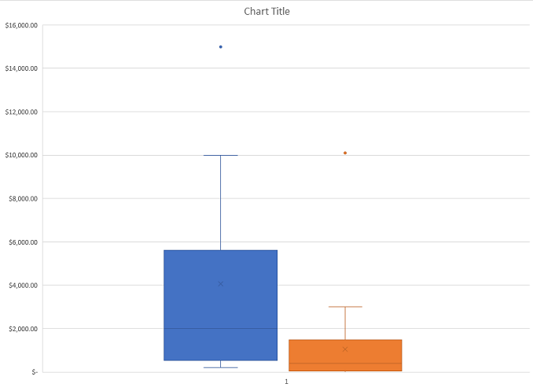
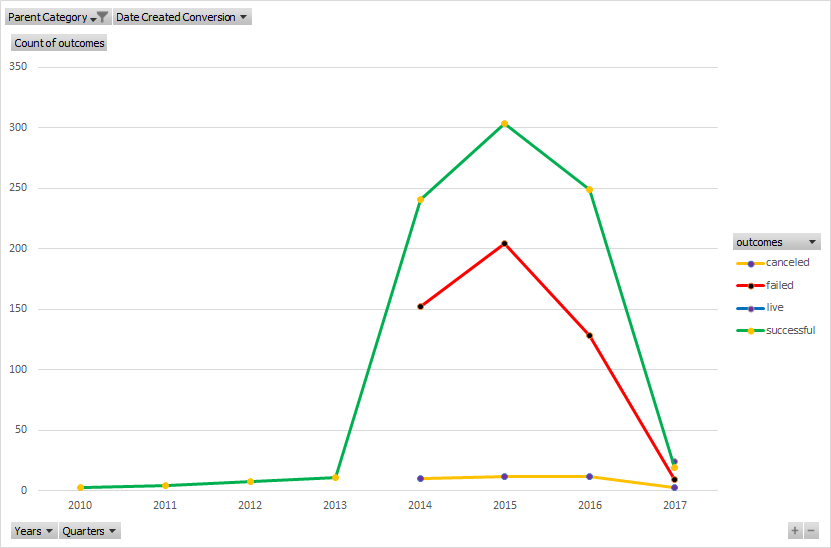
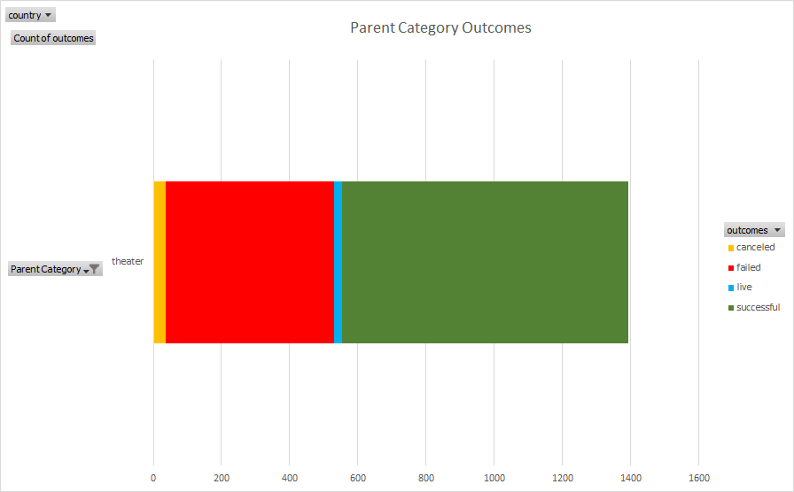
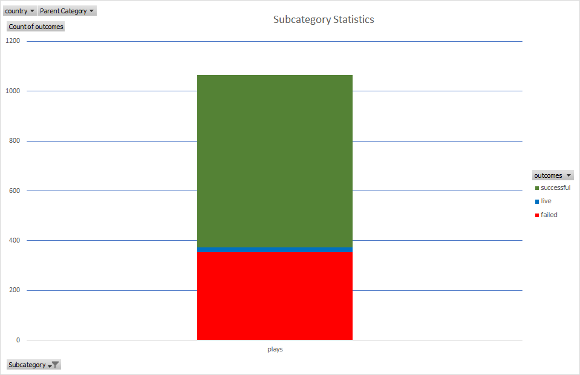

# An Analysis of Kickstarter Campaigns.
Performing analysis on kickstarter data for nth time...

## Question at hand:
Could I get a Crowd Funding Campaign kick started for my play Fever for a budget of $12,000.

## Findings:
Crowd Funding Campaigns are successful when the budget goal is under $2,000.

###Shown by:

###Also depend on launch date:

###Overall outcomes based on all categories are shown below

###Outcomes based on category theatre are as follows

###Outcomes based on sub-category plays are as follows

---

---
## Helpful info:
- comment using html comments <!----> <!--  -->
- use %20 in place of " " (space) in file name eg: Parent Category Outcomes.png => Parent%20Category%20Outcomes.png
---
