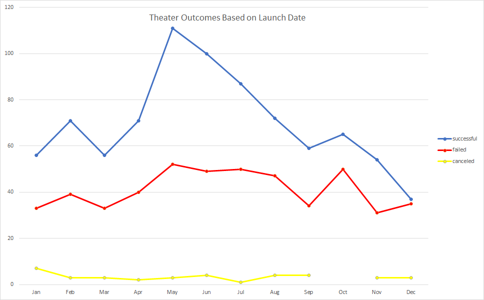

# Kickstarting with Excel

## Overview of Project
Louise launched a crowd funding campaign based on analysis done on the collected kickstarter data. She launched the crowd funding campaign with a reachable goal and picked an appropriate date for the start of the campaign. Her funding goal was achieved, and now she wants to know how different campaigns fared in relation to, their launch date, and their funding goals. 

Following analysis and visualizations below explain how other theatre 'plays' campaigns fared in relation to, their launch date, and funding goals.

### Purpose
The main purpose of this analysis is to show Louise how different campaigns fared in relation to their launch date and their funding goals.
 
## Analysis and Challenges

### Analysis of Outcomes Based on Launch Date

Following conclusions can be inferred from looking at the 'Outcomes vs Launch' chart:
- More campaigns were successful, when launched between Apr and Aug months.
- Campaigns launched in Dec month were less successful.

### Analysis of Outcomes Based on Goals

- Campaigns with goal amounts under $5000 were highly successful in achieving their goal amounts.

### Challenges and Difficulties Encountered

While using excel to analyze the data there could be few challenges like scalability, and reusability. 

## Results

- Conclusions drawn from the Outcomes based on Launch Date
  - More campaigns were successful, when launched between Apr and Aug months.
  - Campaigns launched in Dec month were less successful.

- Conclusion from the Outcomes based on Goals
  - Campaigns with goal amounts under $5000 were highly successful in achieving their goal amounts.
  
- Following limitations were observed while analyzing the dataset
  - Story or theme of the plays were not considered to determine their successes and failures.
  - Duration of the plays were not considered for success or failure outcomes.
  - There is no information regarding the person or persons backing the play and its correlation with the success or failure outcomes.
    
- Some other possible tables and/or graphs that could be created are as follows 
  - Pie charts could be created to show the success rate with respect to launch date.
  - Box and Cross chart could be created to show how the campaigns fared with resepect to their goal amounts.

---

---
## Helpful info:
- comment using html comments "\<!-- --\>" \<!-- comment --\>
- use %20 in place of " " (space) in file name eg: Parent Category Outcomes.png => Parent%20Category%20Outcomes.png
---
